## Purpose
See https://www.dynatrace.com/hub/detail/oracle-connector-hub-signals-ingest/

## Getting Started
**Note:** These actions must be done by a OCI tenancy administrator using the Oracle Cloud Shell or Oracle Code Editor.
Policies must also be configured in the OCI tenant to allow the Service Connector read metrics from the tenant. Users should do this using a group where the resource type is `serviceconnectors` before assigning the following policy: 
`Allow group <GROUP_NAME> to read metrics in tenancy`

## Setup the Application & OCI Function
1. Login to the OCI portal and navigate to **Applications** and click on 'Create Application'. 
2. Enter a name for the application and select a subnet for this application. Change the **Shape** to *GENERIC_ARM* then click on 'Create'
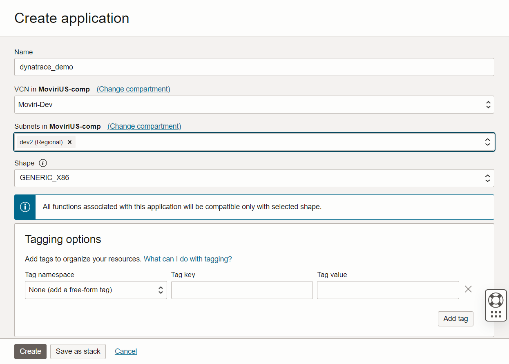
3. Once the application is created you will be rediected to the **Getting started** page. Launch the cloud shell and follow the instructions under **Setup fn CLI on Cloud Shell**.
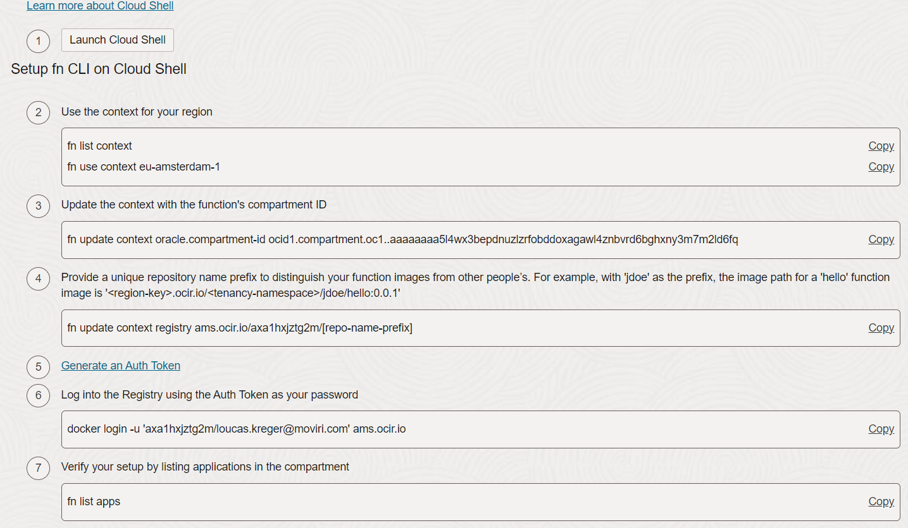
4. In the cloud shell clone the OCI Function from this github repository and enter the directory.
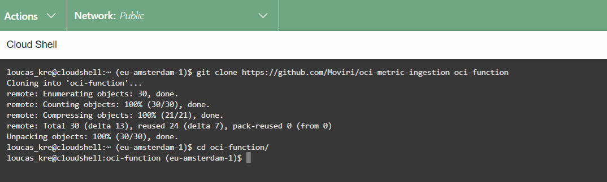
5. Edit the `func.yaml` file using your preferred text editor (`vim` or `nano`) and set the value of `DYNATRACE_TENANT` to your Dynatrace tenant URL. If you're using new Dynatrace then the you may need to replace 'apps' with 'live' in the tenant URL.  
Ex: `https://<tenant id>.apps.dynatrace.com` should be `https://<tenant id>.live.dyntrace.com`
    - If you're using token based authentication, set the  value of  `DYNATRACE_API_KEY` to an API token that has the `metrics.ingest` scope.
    - If you're using an OAuth2 Client for authentication change the `AUTH_METHOD` to `oauth` and enter your client_id, client_secret and URN. Please see the "Configuring an OAuth2 Client" section for more details on the requirements.
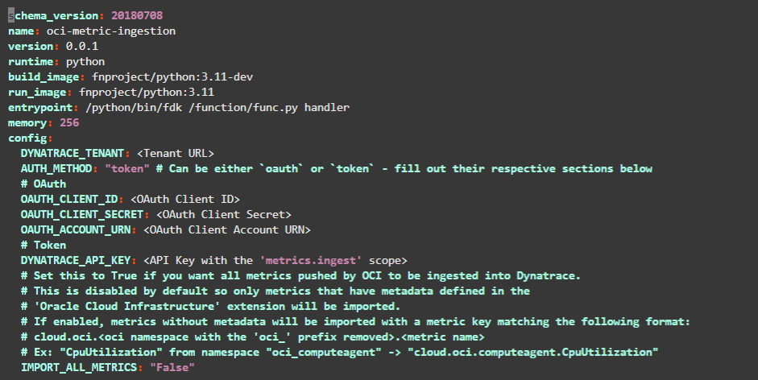
    - Set the configuration option `IMPORT_ALL_METRICS` if you want to import metrics from a namespace that is not supported by the OCI extension. These metrics will not have metadata associated with them.
6. Save and exit the text editor. Now deploy the function using the command `fn -v deploy --app <application name>`
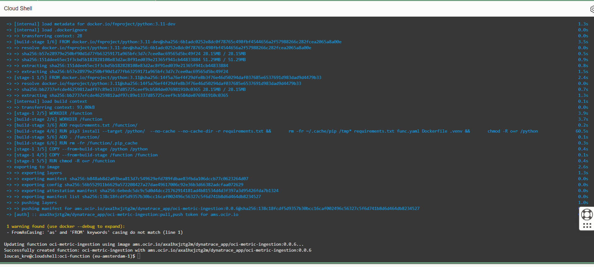
If the deployment succeeded then you should see the image in your OCI container registry.
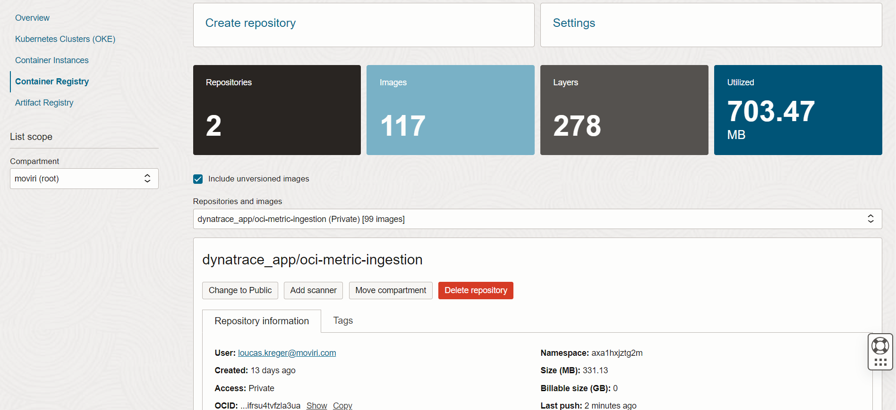

## Create an OCI Connector
1. Navigate to the **Connector Hub** and click on 'Create connector'.
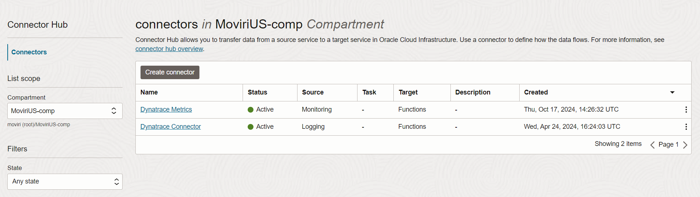
2. Enter a name for the connector and select 'Monitoring' as the **Source** and 'Functions' as the **Target**
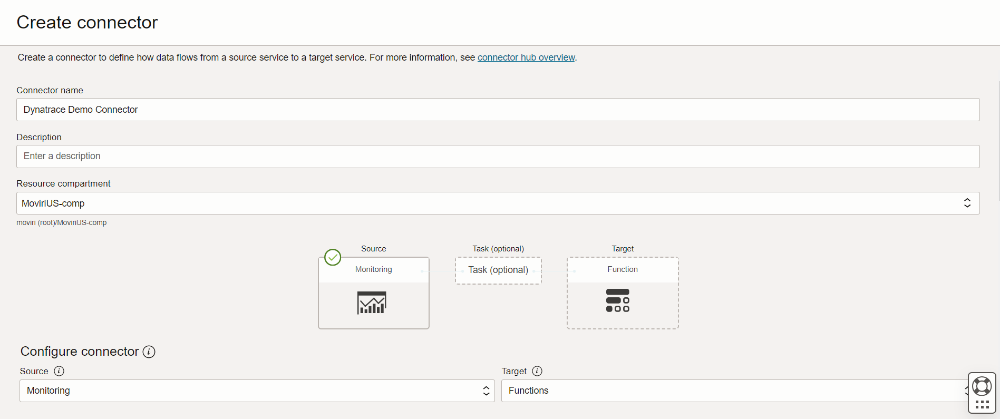
3. Select the compartments and namespaces you want to pull metrics from.
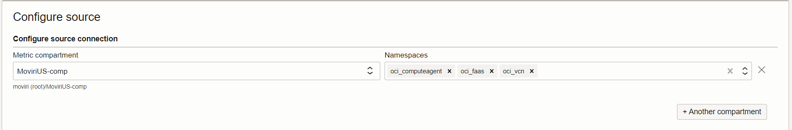
4. Scroll past **Configure task** and choose the compartment, application and function that you just created in the previous setps.
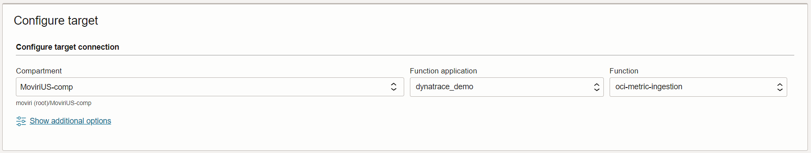
5. If you see a warning asking if you want to create a policy in a given compartment, you *must* click **Create**
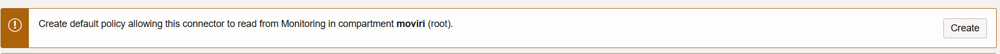
6. Finally click 'Create'
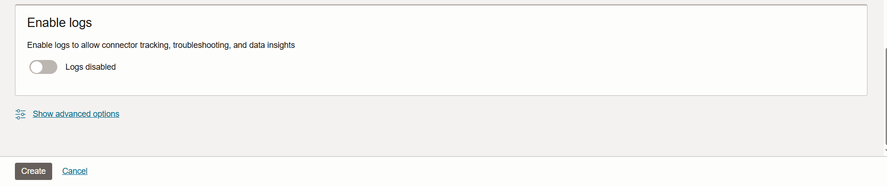
7. Verify the metrics are getting ingested into Dynatrace.

## Configuring an OAuth2 Client
Using an OAuth2 client for the OCI functions will require you to add some additional policies to give the oauth token access to ingest metrics.

1. Visit your Dynatrace tenant's **Account Management** portal and navigate to **Identity & access management** -> **Policy Management**. Click on the add policy button.
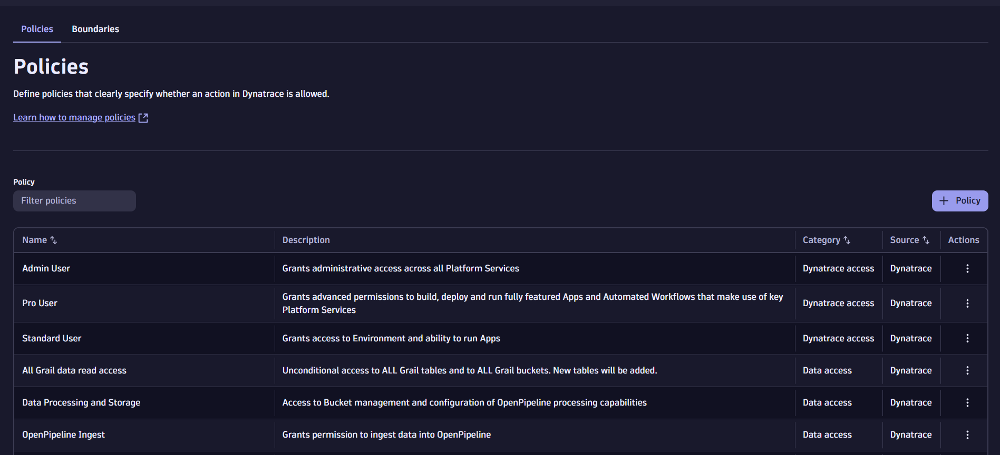
2. Give the policy a name like **Metric Ingest** and paste the following policy statement into the large text box `ALLOW storage:metrics:write;` and click on **Save**
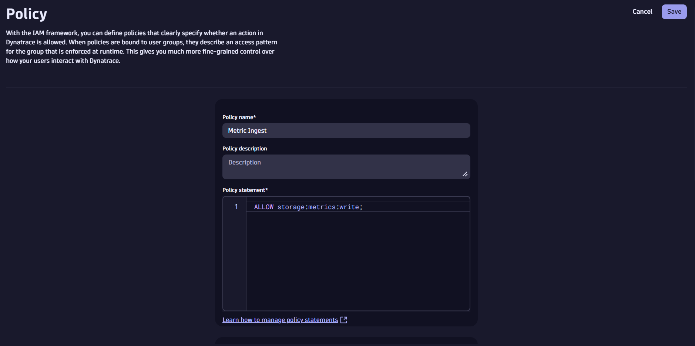
3. Now navigate to the **Service Users** page under **Identity & access management** and click on **Add service user**
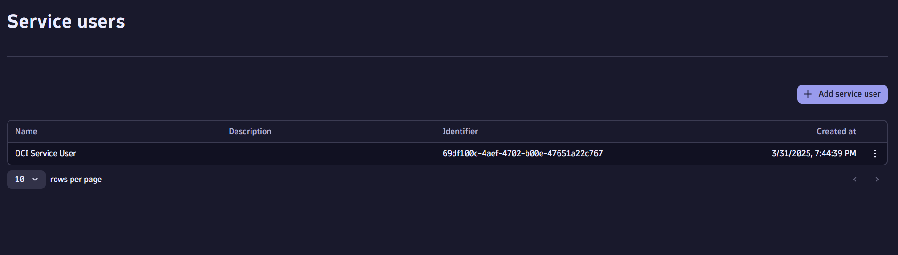
4. Give the user a name and optionally a description then click on **Save**

5. Click on the 3 vertical dots on the right side of the page and select **View Service User**
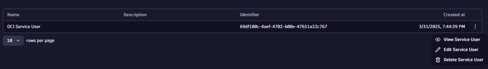
6. Copy the **Service user email** that is displayed on this page, you will need it for step 9.
7. Click on the **+Permission** button and from the dropdown menu select the policy we created in step 2.
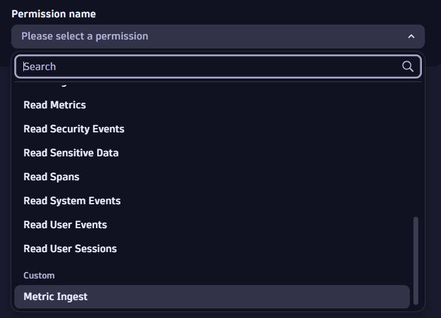
8. Under **Identity & access management** navigate to **OAuth clients** and click on **Create Client**
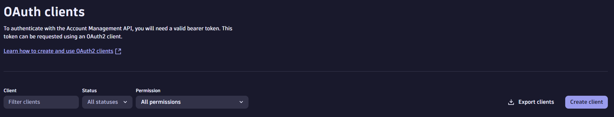
9. Paste the service user email address that you copied in setp 6 in the **Subject user email** text box then assign the user **Write metrics** (`storage:metrics:write`) permission.
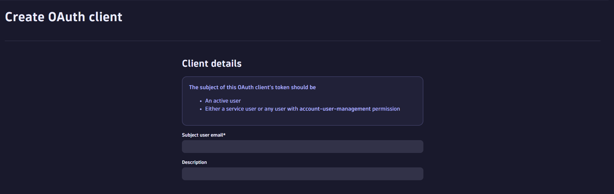
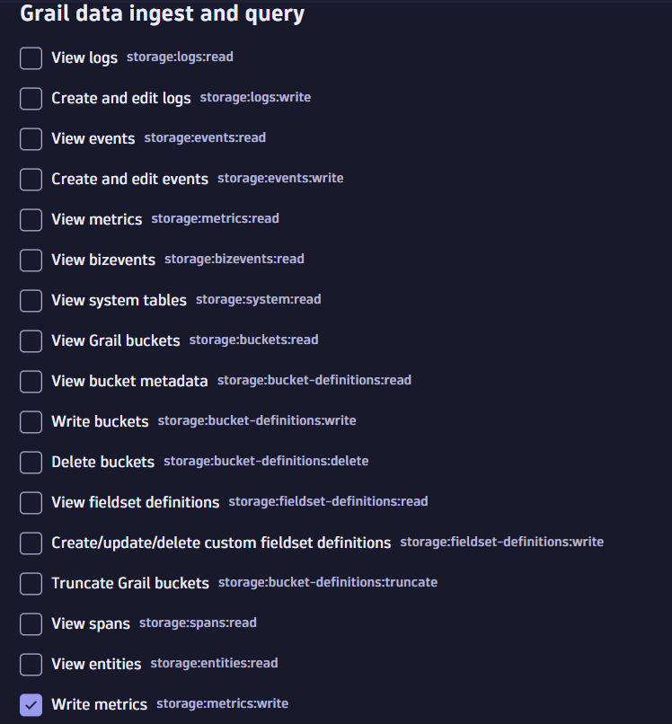
10. Finally click on **Create Client** at the bottom of the page and copy the `client_id`, `client_secret` and `urn` for use with the OCI function.  

## Debugging 
If you are running into issues getting the connector to work, go to the application and enable **Function Invocation Logs**.
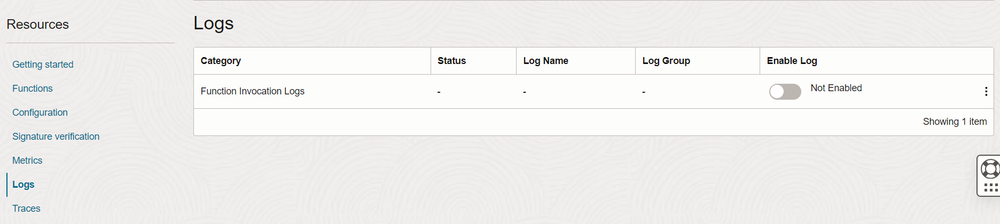
Any errors will be logged here as well as some information about when the function has been run.
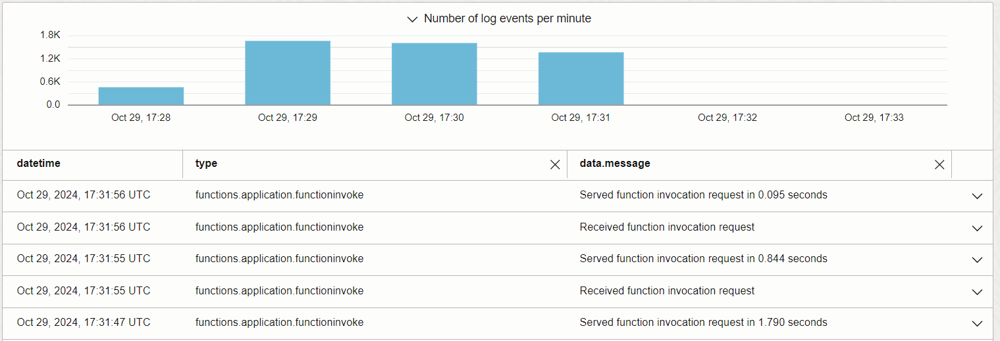
