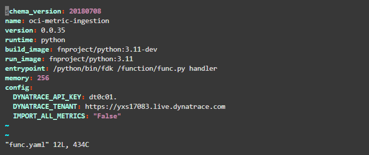

## Getting Started
**Note:** These actions must be done by a OCI tenancy administrator using the Oracle Cloud Shell or Oracle Code Editor.
Policies must also be configured in the OCI tenant to allow the Service Connector read metrics from the tenant. Users should do this using a group where the resource type is `serviceconnectors` before assigning the following policy: 
`Allow group <GROUP_NAME> to read metrics in tenancy`

## Setup the Application & OCI Function
1. Login to the OCI portal and navigate to **Applications** and click on 'Create Application'. 
2. Enter a name for the application and select a subnet then click on 'Create'

3. Once the application is created you will be rediected to the **Getting started** page. Launch the cloud shell and follow the instructions under **Setup fn CLI on Cloud Shell**.

4. In the cloud shell clone the OCI Function from this github repository and enter the directory.

5. Edit the `func.yaml` file using your preferred text editor (`vim` or `nano`) and set the value of  `DYNATRACE_API_KEY` to an API token that has the `metrics.ingest` scope and set the value of `DYNATRACE_TENANT` to your Dynatrace tenant URL. 

    - Set the configuration option `IMPORT_ALL_METRICS` if you want to import metrics from a namespace that is not supported by the OCI extension. These metrics will not have metadata associated with them.
6. Save and exit the text editor. Now deploy the function using the command `fn -v deploy --app <application name>`

If the deployment succeeded then you should see the image in your OCI container registry.

## Create an OCI Connector
1. Navigate to the **Connector Hub** and click on 'Create connector'.

2. Enter a name for the connector and select 'Monitoring' as the **Source** and 'Functions' as the **Target**

3. Select the compartments and namespaces you want to pull metrics from.

4. Scroll past **Configure task** and choose the compartment, application and function that you just created in the previous setps.

5. Finally click 'Create'
6. Verify the metrics are getting ingested into Dynatrace.

## Debugging 
If you are running into issues getting the connector to work, go to the application and enable **Function Invocation Logs**.

Any errors will be logged here as well as some information about when the function has been run.

